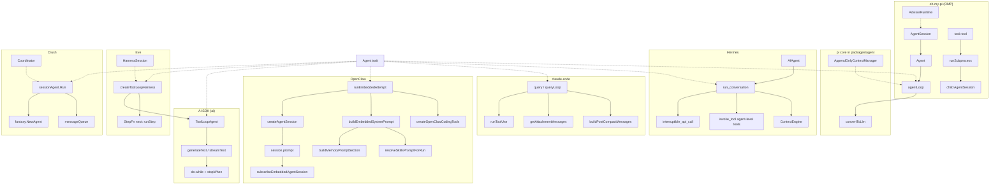

# impl Agent

A **catalog of copied agent-framework designs**, not a runnable program.

The name is deliberate: like Rust's `impl Agent for Foo`, each snippet folder is one real upstream implementation of the same abstract contract — *take user input, call a model, run tools, repeat until done*.

We copy **brain + bone + flesh**, not just the loop:

| Layer | What it covers |
|-------|----------------|
| **Brain** | Core turn loop — prompt → model → tools → repeat |
| **Bone** | Persistence — session files, memory on disk, compaction/flush gates |
| **Flesh** | Injection surfaces — system prompt assembly, skills catalog, tool factories, policy pipelines, event streaming |

## Layout

```text
src/agent.rs              Rust trait — shared vocabulary (abstraction only)
snippets/pi/              Base pi agent core (`packages/agent`) — verbatim TypeScript
snippets/oh-my-pi/        OMP product layer (`packages/coding-agent`) — verbatim TypeScript
snippets/hermes/          Hermes agent core — verbatim Python
snippets/ai/              Vercel AI SDK `ToolLoopAgent` + inner loop — verbatim TypeScript
snippets/eve/             Eve harness on top of AI SDK — verbatim TypeScript
snippets/openclaw/        OpenClaw embedded runner — brain + memory + skills + tools
snippets/crush/           Charm Crush terminal agent — verbatim Go
snippets/claude-code/     Anthropic-style CLI agent — verbatim TypeScript
```

**Snippets are copies**, not ports. Each file header records the upstream path and line range. They are not wired together and will not compile or run in isolation.

### Reference repo registry

Canonical list of upstream clones: [`.agents/skills/crawl-reference-repos/repos.manifest.json`](.agents/skills/crawl-reference-repos/repos.manifest.json). Per-repo crawl maps (entry files, grep terms, worth-next): [`.agents/skills/crawl-reference-repos/reference-repos.md`](.agents/skills/crawl-reference-repos/reference-repos.md). To refresh or extend the catalog, invoke the [crawl-reference-repos](.agents/skills/crawl-reference-repos/SKILL.md) skill after cloning siblings under the parent directory.

Upstream repos (local paths): `../oh-my-pi` (pi core + OMP), `../hermes-agent`, `../ai`, `../eve`, `../openclaw`, `../crush`, `../claude-code`.

## The trait (`src/agent.rs`)

Rust is used only for the waist — a trait that names what every agent loop must expose:

| Trait method | Meaning |
|--------------|---------|
| `run_turn` | Start a turn with new user input |
| `continue_turn` | Resume from current context (retry, tool results on wire) |
| `steer` | Mid-run user input |
| `on_event` | Stream progress to UI / gateway / persistence |
| `budget_remaining` | Iteration cap, if tracked |

Upstream code does not implement this trait. The mapping tables below link trait methods to real symbols in the copied files.

## Architecture overview



---

## `snippets/pi/` — base pi (`packages/agent`)

The portable agent runtime oh-my-pi builds on. Three conceptual layers even within this package:

| Layer | Files | Role |
|-------|-------|------|
| Loop | `agent-loop.entrypoints.ts`, `agent-loop.run-loop-body.ts`, `agent-loop.llm-boundary.ts`, `agent-loop.execute-tool-calls.ts` | Event-stream loop, LLM boundary, tool batch + steering interrupt |
| Stateful wrapper | `agent.steer-followup.ts`, `agent.prompt-and-runloop.ts` | Queues, `subscribe`, delegates to loop |
| Prefix cache | `append-only-context.manager.ts` | Stable system+tools prefix, append-only message log |

| `Agent` trait | Pi symbol |
|---------------|-----------|
| `run_turn` | `agentLoop()` via `Agent.prompt()` |
| `continue_turn` | `agentLoopContinue()` via `Agent.continue()` |
| `steer` | `Agent.steer()` → `config.getSteeringMessages` |
| `on_event` | `Agent.subscribe()` |
| `budget_remaining` | `config.deadline` |

**Worth copying later (not yet):** `agent-loop.ts` Harmony leak recovery, owned tool dialect (`PI_DIALECT`), telemetry spans, `executeToolCalls` concurrency modes.

---

## `snippets/oh-my-pi/` — OMP sauce (`packages/coding-agent`)

Product features on top of pi. These are the main reasons OMP ≠ vanilla pi.

| File | Upstream | What it shows |
|------|----------|---------------|
| `agent-session.prompt.ts` | `session/agent-session.ts` | Entry: slash commands, magic keywords, steer while streaming |
| `agent-session.class-head.ts` | same | `AgentSession` owns `readonly agent: Agent` |
| `agent-session.compact.ts` | same | Manual/auto compaction: `prepareCompaction`, snapcompact vs LLM summary |
| `task.tool.execute.ts` | `task/index.ts` | `TaskTool.execute` — spawn subagents sync vs async |
| `task.executor.run-subprocess.ts` | `task/executor.ts` | `runSubprocess` — `createAgentSession` for child agent |
| `task.executor.drive-session-to-yield.ts` | same | Subagent loop: prompt → idle → yield reminders |
| `tools.yield.ts` | `tools/yield.ts` | Structured subagent completion (`yield` tool) |
| `advisor.runtime.ts` | `advisor/runtime.ts` | Background advisor on `onTurnEnd`, enqueues advice via YieldQueue |

| `Agent` trait | OMP symbol |
|---------------|------------|
| `run_turn` | `AgentSession.prompt()` → `agent.prompt()` |
| `continue_turn` | session retry / `agent.continue()` |
| `steer` | `#queueUserMessage(..., "steer")` while streaming |
| `on_event` | `agent.subscribe` + extension hooks + session persistence |
| `budget_remaining` | `SOFT_REQUEST_BUDGET`, `task.softRequestBudget`, `task.maxRuntimeMs` |

**Worth copying later:** `task/executor.ts` `createSubagentRunMonitor` (budget steer), `async` job manager path in `TaskTool`, `AgentLifecycleManager`, IRC peer coordination, handoff/compaction in `@oh-my-pi/pi-agent-core/compaction`.

---

## `snippets/hermes/` — Hermes (`hermes-agent`)

Hermes brands itself around **persistent learning**: curated file memory (`MEMORY.md` / `USER.md`), pluggable external memory providers (Supermemory, Honcho, …), and a **skills index + `skill_manage`** loop where the agent saves and patches workflows it discovers. Memory and skills are first-class framework surfaces, not optional app glue.

### Brain — conversation loop

| File | Upstream | What it shows |
|------|----------|---------------|
| `run_agent.AIAgent.py` | `run_agent.py` | Class head, `__init__` signature, `chat` / `run_conversation` |
| `conversation_loop.run_conversation.py` | `agent/conversation_loop.py` | Turn setup + main `while` (interrupt, budget, API call) |
| `context_engine.py` | `agent/context_engine.py` | `ContextEngine` ABC |
| `iteration_budget.py` | `agent/iteration_budget.py` | `IterationBudget` |
| `chat_completion_helpers.interruptible_api_call.py` | `agent/chat_completion_helpers.py` | Background-thread API call + interrupt |
| `agent_runtime_helpers.invoke_tool.py` | `agent/agent_runtime_helpers.py` | Agent-level tools before registry (`todo`, `memory`, `delegate_task`, …) |
| `run_agent.delegate_task.py` | `run_agent.py` | `_dispatch_delegate_task` → subagent spawn |

### Bone — memory persistence & recall

| File | Upstream | What it shows |
|------|----------|---------------|
| `memory.store-frozen-snapshot.py` | `tools/memory_tool.py` | `MEMORY.md` / `USER.md` frozen snapshot at session start |
| `memory.manager-orchestration.py` | `agent/memory_manager.py` | `MemoryManager` integration contract + `build_memory_context_block` |
| `memory.manager-prefetch-sync.py` | same | `prefetch_all` / `sync_all` + skill-scaffolding strip before store |
| `memory.provider-abc.py` | `agent/memory_provider.py` | Pluggable provider lifecycle (`prefetch`, `sync_turn`, tools) |
| `memory.turn-prefetch.py` | `agent/turn_context.py` | Prefetch external memory once before tool loop |
| `memory.inject-user-message.py` | `agent/conversation_loop.py` | API-call-time `<memory-context>` fence on user message (not system prompt) |

### Flesh — skills injection & self-improvement guidance

| File | Upstream | What it shows |
|------|----------|---------------|
| `system-prompt.three-tier-memory-skills.py` | `agent/system_prompt.py` | stable / context / volatile tiers; memory + skills slots |
| `skills.guidance-constants.py` | `agent/prompt_builder.py` | `MEMORY_GUIDANCE` + `SKILLS_GUIDANCE` (learn → skill_manage) |
| `skills.build-index-prompt.py` | same | `build_skills_system_prompt` → `<available_skills>` index |
| `skills.scaffolding-extract.py` | `agent/skill_commands.py` | Strip `/skill` scaffolding before memory providers ingest turns |

| `Agent` trait | Hermes symbol |
|---------------|---------------|
| `run_turn` | `run_conversation()` |
| `continue_turn` | `run_conversation(..., conversation_history=…)` |
| `steer` | `_interrupt_requested` in conversation loop |
| `on_event` | `stream_callback`, `step_callback`, `tool_progress_callback`, … |
| `budget_remaining` | `IterationBudget.remaining` |

**Worth copying later:** `agent/background_review.py` (async memory/skill review fork), `tools/skill_manager_tool.py`, `plugins/memory/supermemory/`, `agent/tool_executor.py` concurrent dispatch, `agent/prompt_caching.py`.

---

## `snippets/ai/` — Vercel AI SDK (`ai`)

The **`ToolLoopAgent`** class is the SDK's agent primitive. It does not implement its own loop — it delegates to `generateText` / `streamText`, which run a `do { … } while` over model calls + tool execution until `stopWhen` fires (default `isStepCount(20)`).

| File | Upstream | What it shows |
|------|----------|---------------|
| `tool-loop-agent.ts` | `packages/ai/src/agent/tool-loop-agent.ts` | Class docstring, `prepareCall`, `generate()`, `stream()` → `generateText`/`streamText` |
| `stop-condition.ts` | `packages/ai/src/generate-text/stop-condition.ts` | `StopCondition`, `isStepCount`, `isStopConditionMet` |
| `generate-text.tool-loop.ts` | `packages/ai/src/generate-text/generate-text.ts` | `do` loop entry + continuation condition after tool results |

| `Agent` trait | AI SDK symbol |
|---------------|---------------|
| `run_turn` | `ToolLoopAgent.generate()` or `.stream()` |
| `continue_turn` | next iteration inside `generateText` when last step ends with tool results |
| `steer` | `abortSignal` on call parameters |
| `on_event` | `onStepStart`, `onToolExecutionStart`, `onStepEnd`, stream parts |
| `budget_remaining` | `stopWhen` (default 20 steps) minus `steps.length` |

Natural loop termination (from `ToolLoopAgent` docstring): non-`tool-calls` finish reason, tool without `execute`, tool approval needed, or `stopWhen` met.

**Worth copying later:** `stream-text.ts` streaming loop (mirrors generate), `tool-approval` flow, `prepareStep` hook, `packages/workflow` `WorkflowAgent` (durable variant).

---

## `snippets/eve/` — Eve (`eve`)

[Eve](https://github.com/vercel/eve) is Vercel's agent **framework**. Its harness wraps AI SDK `ToolLoopAgent` but runs it with **`stopWhen: isStepCount(1)`** — exactly one model+tools step per workflow `"use step"` invocation. The **outer** tool loop is Eve's `StepFn`: `handleStepResult` returns `{ next: runStep }` when history ends on a tool message and the turn should continue.

Serializable `HarnessSession` (plain `ModelMessage[]`, tool schemas without execute fns) crosses workflow step boundaries; tool execute functions are rehydrated at step time.

| File | Upstream | What it shows |
|------|----------|---------------|
| `harness.types.ts` | `harness/types.ts` | `HarnessSession`, `StepResult`, `StepFn`, `StepNext` |
| `harness.create-tool-loop.ts` | `harness/tool-loop.ts` | `createToolLoopHarness` → `runStep` / OTel turn span |
| `harness.tool-loop-agent-call.ts` | same | Build `ToolLoopAgent`, `agent.stream({ messages })`, emit stream |
| `harness.handle-step-result.ts` | same | Park on HITL / runtime actions; `{ next: runStep }` continuation |

| `Agent` trait | Eve symbol |
|---------------|------------|
| `run_turn` | `runStep(session, input)` with user message in `StepInput` |
| `continue_turn` | `{ next: runStep }` after tool results appended to `session.history` |
| `steer` | deferred `StepInput` / channel `onDeliver` (park until input arrives) |
| `on_event` | `handleEvent` / `emitStreamContent` → protocol stream |
| `budget_remaining` | workflow-level; per-call retry `MODEL_CALL_MAX_ATTEMPTS` |

**Worth copying later:** `harness/execute-tool.ts`, compaction hooks, code-mode interrupt parking, channel adapters, `packages/workflow` integration.

---

## `snippets/openclaw/` — OpenClaw (`openclaw`)

OpenClaw is a **full product agent framework** built on pi (`createAgentSession` / `session.prompt`). Unlike Eve (one `ToolLoopAgent` step per workflow step), OpenClaw runs a **complete embedded pi session per inbound message attempt**. The copied snippets emphasize framework flesh around that brain.

### Brain — embedded run loop

| File | Upstream | What it shows |
|------|----------|---------------|
| `run-embedded.start.ts` | `embedded-agent-runner/run/attempt.ts` | `runEmbeddedAttempt` entry — sandbox, workspace, prep stages |
| `run-embedded.skills-resolve.ts` | same | Resolve skill entries + `skillsPrompt` before prompt build |
| `run-embedded.system-prompt-build.ts` | same | `buildAttemptSystemPrompt` call site — skills + memory + bootstrap context |
| `run-embedded.session-create-and-prompt.ts` | same | `createAgentSession` + `applySystemPromptToSession` |
| `run-embedded.prompt-active-session.ts` | same | `promptActiveSession` → `activeSession.prompt()` |
| `subscribe.embedded-session.ts` | `embedded-agent-subscribe.ts` | `subscribeEmbeddedAgentSession` — stream state, gateway bridge |

### Bone — memory persistence & flush

| File | Upstream | What it shows |
|------|----------|---------------|
| `memory.root-memory-files.ts` | `memory/root-memory-files.ts` | `MEMORY.md` path resolution on disk |
| `memory.prompt-section.ts` | `plugins/memory-state.ts` | `buildMemoryPromptSection` — plugin-owned memory lines |
| `system-prompt.build-memory-section.ts` | `agents/system-prompt.ts` | `buildMemorySection` gate into system prompt |
| `memory.flush-gate.ts` | `auto-reply/reply/memory-flush.ts` | `shouldRunMemoryFlush` — token threshold before flush run |
| `memory.flush-tool-policy.ts` | `agents/agent-tools.ts` | Memory-flush runs restrict tools to read + append-only write |

### Flesh — skills, tools, bootstrap

| File | Upstream | What it shows |
|------|----------|---------------|
| `skills.load.ts` | `skills/loading/session.ts` | `loadSkills` — agent dir + project skill dirs |
| `skills.embedded-run-entries.ts` | `skills/runtime/embedded-run-entries.ts` | `resolveEmbeddedRunSkillEntries` — snapshot vs live load |
| `skills.format-for-prompt.ts` | `skills/loading/skill-contract.ts` | `formatSkillsForPrompt` — `<available_skills>` XML catalog |
| `skills.resolve-prompt-for-run.ts` | `skills/loading/workspace.ts` | `resolveSkillsPromptForRun` — snapshot or build from entries |
| `tools.common-contracts.ts` | `agents/tools/common.ts` | `AnyAgentTool` / `AgentToolWithMeta` contracts |
| `tools.message-tool-create.ts` | `agents/tools/message-tool.ts` | `createMessageTool` — schema + execute factory pattern |
| `tools.coding-tools-policy-pipeline.ts` | `agents/agent-tools.ts` | `createOpenClawCodingTools` policy resolution + pipeline |
| `tools.provider-schema-normalize.ts` | `embedded-agent-runner/tool-schema-runtime.ts` | `normalizeProviderToolSchemas` — provider plugin hook |
| `system-prompt.build-embedded.ts` | `embedded-agent-runner/system-prompt.ts` | `buildEmbeddedSystemPrompt` + `applySystemPromptToSession` |
| `attempt-system-prompt.ts` | `embedded-agent-runner/run/attempt-system-prompt.ts` | Provider transform wrapper around embedded prompt |
| `bootstrap.context-injection.ts` | `embedded-agent-runner/run/attempt.bootstrap-context.ts` | Bootstrap context file remap for sandbox/workspace |

| `Agent` trait | OpenClaw symbol |
|---------------|-----------------|
| `run_turn` | `runEmbeddedAttempt` → `promptActiveSession(prompt)` |
| `continue_turn` | `activeSession.prompt()` retry / compaction resume inside attempt |
| `steer` | inbound message queue / session write lock (not copied yet) |
| `on_event` | `subscribeEmbeddedAgentSession` → block replies, tool meta, compaction events |
| `budget_remaining` | context window + compaction guards + `shouldRunMemoryFlush` |

**Worth copying later:** `run/attempt.prompt-helpers.ts` (plugin next-turn injection drain), `embedded-agent-runner/compaction-runtime-context.ts`, `skills/loading/workspace.ts` `formatSkillsCompact` + char-budget limits, `agent-tools.ts` tool-search catalog mode, `context-engine/` plugin host.

---

## `snippets/crush/` — Crush (`crush`)

[Crush](https://github.com/charmbracelet/crush) is Charm's terminal coding agent. Brain is Go: `sessionAgent.Run` drives `fantasy.NewAgent` streaming with per-session `messageQueue` steer while busy. `Coordinator.Run` is the product entry. Bone is SQLite sessions. Flesh: context-file + skills XML in `prompt/prompt.go`, `hooked_tool` PreToolUse pipeline, MCP instructions merged at run time.

### Brain — run loop & steer

| File | Upstream | What it shows |
|------|----------|---------------|
| `agent.run-entry.go` | `internal/agent/agent.go` | `Run` entry — busy enqueue, `fantasy.NewAgent`, MCP instructions inject |
| `agent.prepare-step-queue-drain.go` | same | `PrepareStep` — fold queued prompts into step messages |
| `agent.message-queue.go` | same | `enqueueCall` + `drainQueueForStep` — steer queue semantics |
| `coordinator.run.go` | `internal/agent/coordinator.go` | `Coordinator.Run` / `run` — model refresh, `RunComplete` coalescing |

### Bone — session persistence

| File | Upstream | What it shows |
|------|----------|---------------|
| `session.create.go` | `internal/session/session.go` | `Session` struct + SQLite `Create` |

### Flesh — prompt, skills, tools

| File | Upstream | What it shows |
|------|----------|---------------|
| `prompt.context-files-and-skills.go` | `internal/agent/prompt/prompt.go` | `loadContextFiles` + `skills.ToPromptXML` → system prompt data |
| `skills.format-prompt-xml.go` | `internal/skills/skills.go` | `ToPromptXML` → `<available_skills>` catalog |
| `tools.hooked-tool-run.go` | `internal/agent/hooked_tool.go` | PreToolUse hook → allow/deny/halt before inner tool |

| `Agent` trait | Crush symbol |
|---------------|--------------|
| `run_turn` | `sessionAgent.Run(ctx, SessionAgentCall)` via `coordinator.Run` |
| `continue_turn` | `PrepareStep` queue fold + recursive `Run` for queued RunID prompts |
| `steer` | `enqueueCall` while `IsSessionBusy`; `Coordinator.Cancel` |
| `on_event` | `publishRunComplete` / message broker subscribers |
| `budget_remaining` | fantasy streaming step limits; coordinator thinking `budget_tokens` |

**Worth copying later:** full `agent.go` `Stream` callbacks, `internal/permission/`, LSP context in `internal/lsp/`, `internal/agent/tools/mcp/`, `coordinator.Cancel`.

---

## `snippets/claude-code/` — claude-code (`claude-code`)

Anthropic-style CLI agent. Brain: async-generator `query` → `queryLoop` `while (true)` over model + `runToolUse`. Bone: `compactConversation` / `buildPostCompactMessages`. Flesh: `buildEffectiveSystemPrompt`, `getAttachmentMessages` + nested CLAUDE.md traversal, `runPreToolUseHooks`, subagents via `runAgent`.

### Brain — query loop & tools

| File | Upstream | What it shows |
|------|----------|---------------|
| `query.entrypoints.ts` | `src/query.ts` | `query` → `queryLoop` generator entry |
| `query.loop-start.ts` | same | `while (true)` head — prefetch, compact prep, model call setup |
| `query.loop-continue.ts` | same | `maxTurns` gate + state carry into next iteration |
| `toolExecution.run-tool-use.ts` | `src/services/tools/toolExecution.ts` | `runToolUse` — lookup, abort, permission + call pipeline |
| `runAgent.entry.ts` | `src/tools/AgentTool/runAgent.ts` | nested agent `runAgent` spawn + `maxTurns` |

### Bone — compaction

| File | Upstream | What it shows |
|------|----------|---------------|
| `compact.build-and-run.ts` | `src/services/compact/compact.ts` | `buildPostCompactMessages` + `compactConversation` entry |

### Flesh — prompt, context, hooks

| File | Upstream | What it shows |
|------|----------|---------------|
| `systemPrompt.build-effective.ts` | `src/utils/systemPrompt.ts` | `buildEffectiveSystemPrompt` — agent/custom/default merge |
| `attachments.get-messages.ts` | `src/utils/attachments.ts` | `getAttachmentMessages` → yield attachment messages |
| `attachments.nested-memory.ts` | same | `getNestedMemoryAttachmentsForFile` — CLAUDE.md + rules traversal |
| `toolHooks.run-pre-tool-use.ts` | `src/services/tools/toolHooks.ts` | `runPreToolUseHooks` — hook permission + input rewrite |

| `Agent` trait | claude-code symbol |
|---------------|---------------------|
| `run_turn` | `query(params)` → `queryLoop` |
| `continue_turn` | next `while (true)` iteration after tool results appended |
| `steer` | `messageQueueManager` + `createUserInterruptionMessage` |
| `on_event` | `AsyncGenerator` yields (`StreamEvent`, `Message`, attachments) |
| `budget_remaining` | `maxTurns`, `taskBudgetRemaining`, reactive/auto compact gates |

**Worth copying later:** `toolOrchestration.ts` parallel dispatch, `sessionStorage.ts`, `Tool.ts` `findToolByName`, reactive compact path, skill-search prefetch.

---

## Design contrasts

| Concern | Pi / OMP | Hermes | AI SDK | Eve | OpenClaw | Crush | claude-code |
|---------|----------|--------|--------|-----|----------|-------|-------------|
| Loop owner | `agentLoop` generator | `run_conversation` while | `generateText` do-while | harness `StepFn` + `ToolLoopAgent` (1 step) | `runEmbeddedAttempt` → pi `session.prompt()` | `sessionAgent.Run` → fantasy agent | `query` / `queryLoop` async generator |
| Message model | `AgentMessage` → `convertToLlm` | OpenAI dicts | `ModelMessage` | `ModelMessage` on `HarnessSession` | pi `AgentMessage` via embedded session | fantasy messages + SQLite session | Anthropic SDK message dicts |
| Memory | extension hooks / session file | `MEMORY.md`/`USER.md` frozen snapshot + provider prefetch fence | — | workflow session state | `MEMORY.md` + plugin `buildMemoryPromptSection` + flush runs | context files via `loadContextFiles` | attachment messages + CLAUDE.md traversal |
| Skills inject | extension / product layer | `<available_skills>` index + `skill_view` / `skill_manage` | app-level | runtime rehydrate | `<available_skills>` XML in system prompt | `SKILL.md` catalog in `internal/skills/` | skill search prefetch (feature-gated) |
| Tool surface | registry + extensions | agent-level + registry | `ToolSet` on agent | rehydrate at step | `createOpenClawCodingTools` + policy pipeline | hooked tools + MCP | `Tool.ts` registry + `runToolUse` |
| Subagents | `task` → child session | `delegate_task` | — (app-level) | delegated sessions via runtime | sandbox subagent session keys | — (coordinator multiplex) | `runAgent.ts` nested runs |
| Mid-run input | steering queue | interrupt flag | `abortSignal` | park + resume `StepInput` | session write lock + inbound queue | `messageQueue` while busy | command queue + interruption messages |
| Tool approval | extension hooks | `approval_callback` | `toolApproval` / `needsApproval` | park `PendingInputBatch` | hooks + message tool delivery modes | `internal/permission/` + PreToolUse hooks | `canUseTool` + `toolHooks` |
| Step budget | deadline / soft budget | `IterationBudget` | `stopWhen` (default 20) | `isStepCount(1)` per workflow step | context window + compaction + memory flush gate | fantasy turn limits | `maxTurns` + reactive/auto compact |

## What this repo is not

- **Not a framework** — no build, no dependency wiring.
- **Not a translation** — TypeScript, Python, and Go copied verbatim (middle sections omitted where noted in headers).
- **Not exhaustive** — see “Worth copying later” lists above.

## Adding another `impl`

1. Add the repo to [repos.manifest.json](.agents/skills/crawl-reference-repos/repos.manifest.json) and a crawl section in [reference-repos.md](.agents/skills/crawl-reference-repos/reference-repos.md).
2. Clone upstream as a sibling (`../<clone_dir>/`), then invoke [crawl-reference-repos](.agents/skills/crawl-reference-repos/SKILL.md).
3. Copy upstream functions/classes into `snippets/<name>/` with a source header.
4. Map symbols to `src/agent.rs` in this file (marker `impl Agent for Foo` only).
5. Do not rewrite into Rust except for trait documentation.
